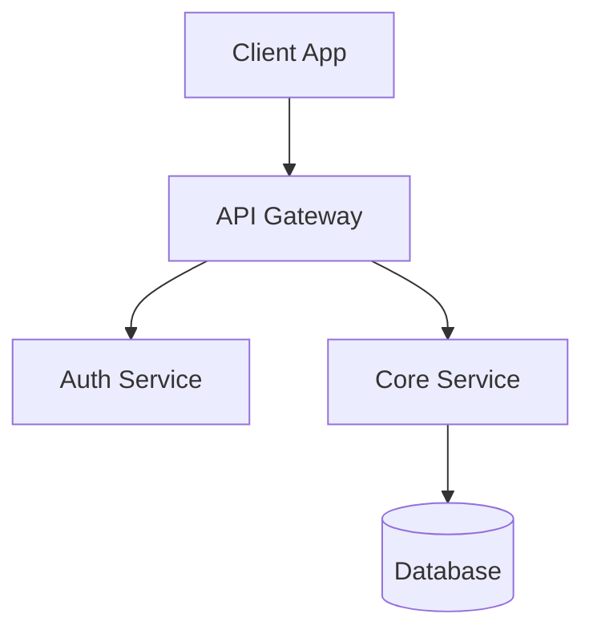
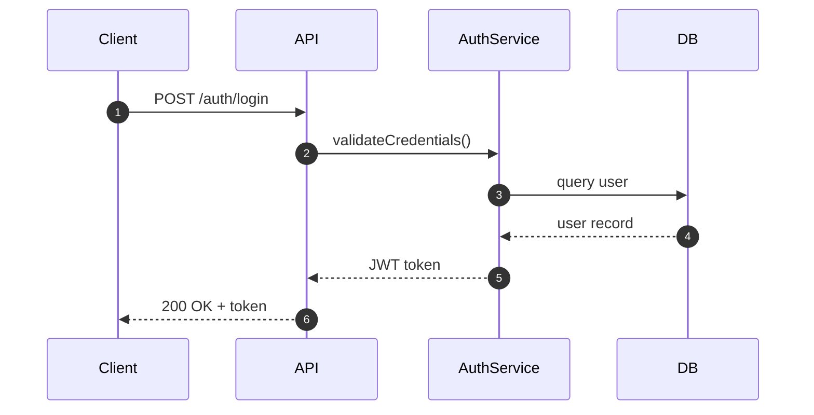
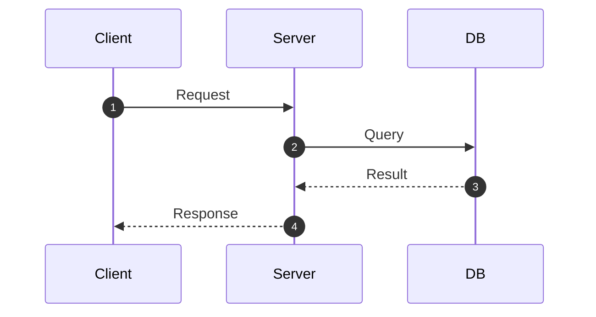
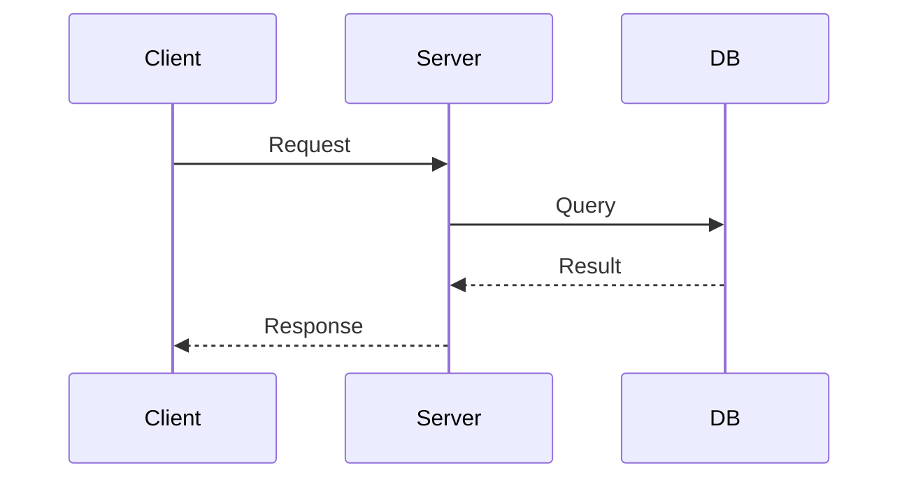

# Wiki Page Writer — Acceptance Criteria

## Mermaid Diagrams

### ✅ Correct
````markdown
## Architecture



## Data Flow


````

### ❌ Incorrect
````markdown
## Architecture

The system has multiple components that work together.

No diagrams provided.
````

## Source Citations

### ✅ Correct
```markdown
The authentication middleware (`src/auth/middleware.ts:42`) validates JWT tokens
using the secret from configuration (`src/config/auth.ts:15`). Failed validation
triggers the error handler (`src/errors/handler.ts:28`), which logs via the
logger service (`src/utils/logger.ts:10`). Token refresh is handled by
the refresh controller (`src/controllers/auth.ts:85`).
```

### ❌ Incorrect
```markdown
The authentication middleware validates JWT tokens using the secret from
configuration. Failed validation triggers the error handler.
```

## Sequence Diagram Autonumber

### ✅ Correct


### ❌ Incorrect


## Page Structure

### ✅ Correct
```markdown
## Overview
Brief summary of the component.

## Architecture
System design with graph diagram.

## Core Components
| Component | Purpose | File |
|-----------|---------|------|
| AuthService | Token validation | `src/auth/service.ts` |

## Data Flow
Sequence diagram with autonumber.

## Implementation Details
Key algorithms and error handling.

## References
- `src/auth/service.ts` — Authentication service
- `src/config/auth.ts` — Auth configuration
```

### ❌ Incorrect
```markdown
## About
This component does things.

## Details
It works by processing data.
```
